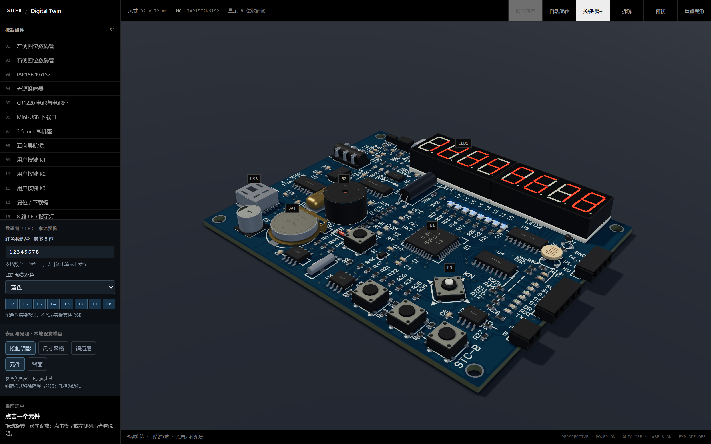

# STC-B Digital Twin

[](https://github.com/DeliciousBuding/stcb-board-3d-viewer/actions/workflows/ci.yml)
[](https://github.com/DeliciousBuding/stcb-board-3d-viewer/actions/workflows/pages.yml)
[](LICENSE)
[](https://nodejs.org/)

[English](README.md) | [简体中文](README.zh-CN.md)

An embeddable, programmable browser digital twin for the STC-B learning board. The viewer builds the PCB, packages, solder joints, materials, display, and LEDs in Three.js, then accepts validated state patches from any host transport.



> Community project. STC-B and related marks belong to their respective owners.

## Product highlights

- Interactive 92 × 72 mm board with 34 selectable components, orthographic inspection, back-side viewing, component isolation, and exploded assembly.
- Four independent front/back silk and copper layers derived from reference vector artwork; no runtime PDF dependency.
- Procedural manufacturing detail for openings, bent leads, through-hole meniscus, SMD terminations, solder masks, surface grain, and contact shadows.
- Renderer-only display state for an eight-character display and eight LEDs.
- Stable browser integration through `window.stcbBoardViewer` or a sandbox-friendly `postMessage` contract.
- Event-driven rendering that sleeps when idle and wakes for interaction, animation, or state changes.

## Quick start

Requires Node.js 22.12+ and pnpm 10.

```bash
pnpm install
pnpm dev
```

Build and preview production output:

```bash
pnpm build
pnpm preview
```

Run the complete local gate:

```bash
pnpm check
```

## Embed the digital twin

The viewer does not open serial ports, call a product API, or issue device commands. A host adapter translates the latest device snapshot into the renderer contract.

### Same-page API

```ts
window.stcbBoardViewer.setVisualState({
  powered: true,
  display: '12345678',
  ledMask: 0b10101010,
  ledColor: 'blue',
})

const state = window.stcbBoardViewer.getVisualState()
```

### iframe and postMessage

```ts
window.addEventListener('message', (event) => {
  if (event.data?.type === 'stcb-board:ready') {
    event.source?.postMessage({
      type: 'stcb-board:set-state',
      state: { powered: true, display: '12345678', ledMask: 0xff },
    }, event.origin)
  }
})
```

The viewer emits `stcb-board:ready`, replies with `stcb-board:state`, and reports validation failures as `stcb-board:error`. Production hosts must verify `event.origin`.

Use `?embed=1` for a chrome-free canvas suitable for dashboards and digital-twin panels. See [`docs/INTEGRATION.md`](docs/INTEGRATION.md) for adapter patterns, reconnect behavior, and a CloudPath mapping example.

## State contract

| Field | Type | Meaning |
|---|---|---|
| `powered` | `boolean` | Render the energized state; stale or offline sources should set `false` |
| `display` | `string` | Up to 8 digits, spaces, or hyphens; shorter values are padded |
| `ledMask` | `0..255` | Bit 0 is rightmost L0; bit 7 is leftmost L7 |
| `ledColor` | `blue \| red \| green` | Preview palette only; not a claim that the board supports RGB |

Patches merge by field and reject invalid values. The current model describes character display rather than raw segment frames; a device adapter should translate its protocol before extending this contract.

## Repository layout

```text
src/
  board-layout.ts       Board dimensions, package orientation, component inventory
  packages.ts           Package, lead, opening, and emissive geometry
  detail-geometry.ts    Solder meniscus, drilled pads, and bent leads
  board-artwork.ts      Front/back vector layers and packed surface channels
  board-model.ts        PCB assembly, component instances, and visual state
  render-studio.ts      Lighting, environment, shadows, and render diagnostics
  visual-state.ts       State validation and immutable snapshots
tools/
  extract_artwork.py    Optional regeneration from a lawfully held reference PDF
  screenshot.mjs        Browser regression and screenshot runner
```

## Regenerate board artwork

Prebuilt SVG layers are included, so the viewer runs without Python or the original PDF. To regenerate assets you control:

```bash
python -m pip install pymupdf
python tools/extract_artwork.py \
  --pdf /path/to/reference-board-schematic.pdf \
  --source-label reference-board-schematic.pdf
```

The exporter validates the four input layers, one-to-one front/back pad registration, and pad error bounds. It never replaces existing assets after a failed validation. Source PDFs and reference photographs are not distributed with this repository.

## Fidelity and limits

- This is a visual reconstruction, not mechanical CAD, Gerber, a netlist, or DRC output.
- Pad centers come from assembly artwork; drill sizes, component height, and solder shape remain visual approximations.
- Documented reference differences are preserved instead of being guessed into a BOM.
- Browser regression proves rendering and interaction behavior, not physical assembly, electrical behavior, or dimensional acceptance.
- `tools/screenshot.mjs` uses system Edge by default and accepts `--channel` for another Playwright browser channel.

## Security and release

- Runtime assets are local; no remote scripts, fonts, or models are loaded.
- The repository contains no credentials, device inventory, serial logs, or personal material.
- CI runs type checking, Node/Python tests, and a production build on `ubuntu-latest`.
- GitHub Pages is built by [`pages.yml`](.github/workflows/pages.yml); local `dist` files are never uploaded.

## Contributing

See [`CONTRIBUTING.md`](CONTRIBUTING.md). Report sensitive issues through [`SECURITY.md`](SECURITY.md).

## License

Code is released under the [Apache License 2.0](LICENSE). Copyright and third-party or derived-artwork attribution are described in [`NOTICE.md`](NOTICE.md).
